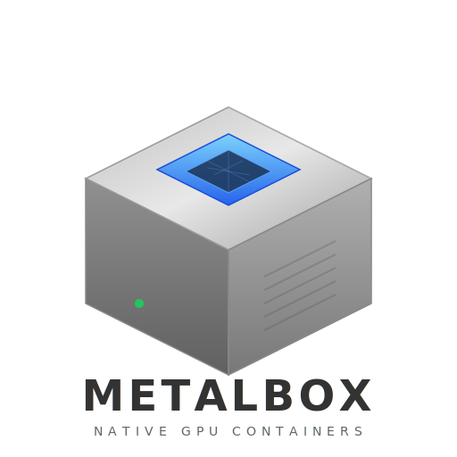

# MetalBox

<p align="center">
  
</p>

<p align="center">
  <a href="https://pypi.org/project/metalbox/"></a>
  <a href="https://pypi.org/project/metalbox/"></a>
  <a href="https://github.com/ronxldwilson/MetalBox/blob/main/LICENSE"></a>
  <a href="https://github.com/ronxldwilson/MetalBox"></a>
</p>

<p align="center">
  <a href="#quick-start">Quickstart</a> · <a href="#web-dashboard">Dashboard</a> · <a href="#interactive-tui">TUI</a> · <a href="#cli">CLI</a> · <a href="#config">Config</a> · <a href="#how-resource-limits-work">How it works</a>
</p>

Lightweight process containerization for macOS Apple Silicon. Run ML workloads with Metal/MLX acceleration and Docker-like resource limits — without a Linux VM.

## The problem

Every container runtime on macOS (Docker, Podman, OrbStack, Lima) runs a Linux VM. Linux doesn't have Metal. So you can't use MLX, MPS, or any Metal-accelerated framework inside a container. You're stuck choosing between:

- **Docker** — real resource limits, but no GPU, 3x slower for ML inference
- **Native** — full Metal speed, but no resource limits, no lifecycle management, dangerous on a shared machine

MetalBox gives you both: **native Metal performance with container-like resource management.**

## How it works

MetalBox is a Go server that runs your workloads as native macOS processes with enforced resource limits, health checks, and a web dashboard for monitoring.

```
┌──────────────────────────────────────┐
│  metalbox-dashboard (Go binary)      │
│                                      │
│  ┌────────────┐  ┌────────────────┐  │
│  │ your app   │  │ resource guard │  │
│  │ (native    │◄─│ • RSS watchdog │  │
│  │  macOS     │  │ • Metal mem cap│  │
│  │  process)  │  │ • CPU policy   │  │
│  └────────────┘  └────────────────┘  │
│        │              │              │
│   Metal / MLX / MPS   │ health checks│
│   (direct GPU access) │ log capture  │
│                       │ auto-restart │
│  ┌─────────────────────────────────┐ │
│  │  web dashboard (localhost:9090) │ │
│  │  start/stop/restart • logs      │ │
│  │  RSS/CPU graphs • events        │ │
│  └─────────────────────────────────┘ │
└──────────────────────────────────────┘
```

## Quick start

```bash
# Install from PyPI (macOS Apple Silicon)
pip install metalbox

# Or install with uv
uv tool install metalbox

# Create a metalbox.yml (see Config below), then:
metalbox serve
# Open http://localhost:9090
```

## Web dashboard

The dashboard runs on `localhost:9090` and provides:

- **Service overview** — status, PID, RSS, CPU%, memory usage bars
- **Sortable columns** — click any column header to sort; order persists across auto-refreshes
- **GPU memory monitoring** — active/peak/cache usage for Metal/MLX workloads
- **Detail panel** — click a service to see Logs, Stats, and Charts tabs
- **Charts tab** — RSS and CPU area graphs with limit lines and time labels
- **Resource history sparklines** — inline charts showing RSS trends over time
- **Start / Stop / Restart** buttons per service
- **Log viewer** with auto-refresh
- **Event timeline** — starts, stops, OOM kills, health check failures, restarts
- **Auto-refresh** every 3 seconds

## Interactive TUI

For a terminal-native experience (like lazydocker):

```bash
metalbox top
```

- Left sidebar with service list, status icons, and memory bars
- Right panel with Logs, Stats, and Events tabs
- Keyboard driven: `j`/`k` navigate, `Tab` switches panels, `s` start/stop, `r` restart, `q` quit
- Auto-refreshes every 2 seconds

## CLI

A thin Python CLI is also available, talking to the dashboard API:

```bash
# Install globally
pip install metalbox
# or
uv tool install metalbox

metalbox serve                   # start the dashboard server + web UI
metalbox serve -d                # start in background (detached)
metalbox top                     # interactive TUI (like lazydocker)
metalbox ps                      # show services + resource usage
metalbox start myapp             # start a service
metalbox stop myapp              # stop a service
metalbox restart myapp           # restart a service
metalbox logs myapp              # view logs
metalbox logs myapp -f           # follow log output (tail -f style)

# One-shot execution (no server, no config file needed)
metalbox run --memory 2g "python train.py"
metalbox run --memory 512m --metal-memory 1g "python -m uvicorn app:app"
metalbox run --cpus background "python bench.py"
```

### `metalbox run`

Run any command with resource limits — no YAML config or dashboard server needed. MetalBox starts the process, enforces limits, and exits when it finishes.

```bash
metalbox run [OPTIONS] "command"

Options:
  -m, --memory        RSS memory limit (e.g. 2g, 512m)
  --metal-memory      Metal GPU memory limit
  --metal-cache       Metal cache limit
  --cpus              CPU policy: default or background
  --name              Service name (default: derived from command)
```

## Config

`metalbox.yml` in your project directory:

```yaml
services:
  inference:
    command: python -m uvicorn app:app --host 0.0.0.0 --port 8080
    workdir: /path/to/your/project
    env:
      MODEL_CACHE: /tmp/models
    resources:
      memory: 2.5g          # hard RSS limit — process killed + restarted if exceeded
      metal_memory: 2g      # Metal heap cap (mx.metal.set_memory_limit)
      metal_cache: 512m     # Metal cache cap (mx.metal.set_cache_limit)
      cpus: background      # "background" = E-cores only, "default" = all cores
    restart: unless-stopped  # always | unless-stopped | on-failure | no
    healthcheck:
      url: http://127.0.0.1:8080/healthz
      interval: 30
      timeout: 10
      retries: 3
      start_period: 120

  proxy:
    command: caddy reverse-proxy --from :443 --to :8080
    ports: [443]                # fail-fast if port already in use
    resources:
      memory: 128m
    restart: always
    depends_on:                 # start after these services are healthy
      - inference
    sandbox:                    # filesystem + network isolation (macOS sandbox-exec)
      preset: binary            # runtime preset: python | node | binary
      allow_net: true           # allow network access (default: false)
      localhost_only: true      # restrict to localhost only (default: false)
      read_only:                # can read but not write these paths
        - /etc/config
      read_write:               # additional writable paths (workdir + /tmp always allowed)
        - /var/data
      deny_exec: true           # block spawning new processes (default: false)
```

### Process sandbox

MetalBox uses macOS `sandbox-exec` (Seatbelt) for process isolation. Two modes:

**Permissive (default)** — allow everything, deny filesystem writes outside workdir:
```yaml
sandbox:
  allow_net: true
```

**Strict (deny-default, Docker-like)** — deny everything, explicitly allow only what's needed. Enabled automatically when using a preset, or set `strict: true` manually:
```yaml
sandbox:
  preset: python        # auto-configures for Python/MLX/uv runtimes
  allow_net: true
  localhost_only: true  # can only talk to localhost, not the internet
```

#### Runtime presets

| Preset | What it allows |
|--------|---------------|
| `python` | pyenv, venv, conda, uv, pip, huggingface/mlx model caches |
| `node` | nvm, npm, yarn, pnpm |
| `binary` | Minimal — only system libs. For compiled Go/Rust/C binaries |

#### What strict mode blocks by default

- **Sensitive paths** — `~/.ssh`, `~/.aws`, `~/.gnupg`, `~/.docker`, `~/.kube`, `~/.pypirc`, `~/.netrc` (no credential leaks)
- **Filesystem writes** — only workdir, logs, tmp, and caches are writable
- **IPC** — restricts shared memory to Apple system services only
- **Network** — denied unless `allow_net: true`; add `localhost_only: true` to block external connections

You can add custom deny paths:
```yaml
sandbox:
  strict: true
  deny_paths:
    - /Users/me/secrets
    - /Users/me/.env
```

### Service dependencies

`depends_on` delays a service's start until its dependencies are healthy. If a dependency has a `healthcheck`, MetalBox waits for it to pass before starting the dependent service. If there's no healthcheck, it waits for the process to be running.

```yaml
services:
  api:
    command: python -m uvicorn app:app --port 8080
    healthcheck:
      url: http://127.0.0.1:8080/healthz
      interval: 10
      retries: 3
      start_period: 60

  proxy:
    command: caddy reverse-proxy --from :443 --to :8080
    depends_on:
      - api    # proxy won't start until api's healthcheck passes
```

### Environment isolation

By default, services get a **clean environment** — only essential system vars (`PATH`, `HOME`, `USER`, `SHELL`, `LANG`, `TERM`, `TMPDIR`) plus your declared `env:` vars. No inherited `AWS_*`, `GITHUB_*`, `SSH_*`, or other secrets leak in.

To opt into full parent env inheritance, set `env_inherit: true` on a service.

## How resource limits work

| Resource | Mechanism | Hard? |
|----------|-----------|-------|
| **Memory (RSS)** | Go watchdog polls `footprint` every 5s across the full process tree — kills + auto-restarts if exceeded | Yes (kill + restart) |
| **Metal memory** | Wrapper injection: auto-generates a Python script calling `mx.metal.set_memory_limit()` before your app imports anything | Yes (Metal API) |
| **Metal cache** | Same wrapper calls `mx.metal.set_cache_limit()` | Yes (Metal API) |
| **CPU** | `taskpolicy -b` for background QoS (E-cores only), or default (all cores) | Structural (not %) |
| **Health checks** | HTTP GET / TCP connect / shell command — restart on consecutive failures | Configurable retries |

macOS has no cgroups. RSS limits (`ulimit -m`) are silently ignored by the kernel. MetalBox enforces memory limits by monitoring RSS across the entire process tree (using macOS `footprint` for accurate measurement) and killing if exceeded — then auto-restarting per the configured restart policy.

### GPU monitoring

For Metal/MLX workloads, the dashboard shows real-time GPU memory usage (active, peak, and cache) alongside RSS. A background reporter thread in the Metal wrapper writes stats to `~/.metalbox/stats/` every 5 seconds, which the dashboard picks up automatically.

The dashboard also renders **resource history sparklines** — inline SVG charts showing RSS trends over the last 60 samples, so you can spot memory leaks or load patterns at a glance.

### Metal memory injection

For Python/MLX workloads, MetalBox auto-generates a wrapper script that calls `mx.metal.set_memory_limit()` and `mx.metal.set_cache_limit()` before your app loads any models. The wrapper is transparent — it detects `python -m module` and `python script.py` patterns (including `uv run python` prefix) and rewrites the command to go through the wrapper first.

## Architecture

```
metalbox/
├── dashboard/
│   ├── main.go             # Go server — process supervisor, RSS guard,
│   │                       #   health checks, Metal wrapper, REST API
│   ├── tui.go              # bubbletea TUI (metalbox top)
│   └── static/
│       └── index.html      # embedded web dashboard (single file)
├── metalbox/
│   ├── __init__.py
│   └── cli.py              # thin Python CLI (talks to Go server API)
├── pyproject.toml           # Python CLI package config
└── metalbox.yml             # your service config (gitignored)
```

The Go binary is the runtime — it handles everything:
- Process lifecycle (start, stop, restart, PID files)
- PID ownership verification (prevents killing unrelated processes on PID reuse)
- RSS memory watchdog (kill + restart on exceed)
- Metal/MLX memory limit injection (auto-generated Python wrapper)
- CPU policy via `taskpolicy`
- Health checks (HTTP, TCP, command)
- Process sandboxing via macOS sandbox-exec (Seatbelt)
- Log capture to `~/.metalbox/logs/`
- Web dashboard + REST API + interactive TUI
- Event tracking (OOM kills, health failures, restarts)
- Graceful shutdown (SIGINT/SIGTERM kills only owned processes)

The Python CLI is optional — a thin client that calls the REST API for terminal use.

## Comparison

| | Docker | MetalBox | Native script |
|---|---|---|---|
| Metal / MLX / MPS | No | **Yes** | Yes |
| Memory limits | Hard (cgroups) | Hard (watchdog + kill) | None |
| CPU limits | Hard (cgroups) | Structural (E-cores) | None |
| Health checks | Yes | Yes (HTTP/TCP/CMD) | None |
| Web dashboard | Docker Desktop | Yes (localhost:9090) | None |
| Lifecycle management | Full | Yes | Manual |
| Filesystem isolation | Full (namespaces) | Write restrictions (sandbox-exec) | None |
| Network isolation | Full (namespaces) | Yes (sandbox-exec) | None |
| Environment isolation | Yes | Yes (clean env by default) | None |
| Port conflict detection | Yes | Yes (fail-fast) | None |
| Works on Linux | Yes | No (macOS only) | No |

## Installation

```bash
# From PyPI (recommended — includes pre-built Go binary)
pip install metalbox

# Or with uv
uv tool install metalbox

# From source
git clone https://github.com/ronxldwilson/metalbox.git
cd metalbox
./build.sh         # builds Go binary + Python wheel
pip install dist/*.whl
```

Pre-built wheels are published for **Apple Silicon (arm64)** Macs. Intel Macs are not supported (Metal requires Apple Silicon).

## Requirements

- macOS 14+ on Apple Silicon
- Go 1.21+ (only needed if building from source)
- Python 3.10+ (optional, for CLI only)

## License

MIT
